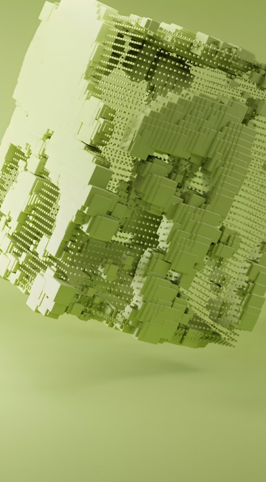

# 🎵 Neumorphic Music Player UI (Flutter)

A modern and minimal **Neumorphic Music Player UI** built using Flutter.
This project focuses on soft UI design with realistic shadows and smooth user experience.

---

## ✨ Features

* 🎧 Neumorphism (Soft UI)
* 🖼️ Album art display
* ❤️ Like button
* 🎚️ Custom progress bar
* 🎮 Music controls (Play / Pause / Next / Previous)
* 📱 Responsive layout

---

## 📸 Preview



---

## 🛠️ Tech Stack

* Flutter
* Dart
* Material UI

---

## 📂 Project Structure

```id="l9jz5g"
lib/
│── main.dart
│
├── pages/
│     └── home_page.dart
│
├── utils/
│     ├── morphic_cart.dart
│     ├── player_container.dart
│     └── player_control.dart
│
assets/
└── images/
      ├── image.png
      ├── image1.jpg
      ├── image3.jpg
      ├── letter.png
      ├── next.png
      ├── pause.png
      └── previous-track.png
```

---

## 🚀 Getting Started

### 1. Clone the repository

```id="3r2uhv"
git clone https://github.com/your-username/neumorphic-music-player.git
```

### 2. Go to project folder

```id="g1ye9m"
cd neumorphic-music-player
```

### 3. Install dependencies

```id="9w0m4g"
flutter pub get
```

### 4. Run the app

```id="7r2s4c"
flutter run
```

---

## ⚙️ Assets Setup

Make sure your `pubspec.yaml` includes:

```id="xjcvfq"
flutter:
  assets:
    - assets/images/
```

---

## 🎯 UI Highlights

* Soft light (top-left) & dark (bottom-right) shadows
* Rounded containers for neumorphic feel
* Minimal grayscale theme
* Clean spacing and alignment

---

## 📌 Future Improvements

* 🔊 Audio integration
* 🎶 Playlist system
* 🌙 Dark mode
* 🎬 Animations
* 🎚️ Interactive sliders

---

## 👨‍💻 Author

**Priyanshu Dangi**

---

## ⭐ Support

If you like this project, give it a ⭐ on GitHub!
